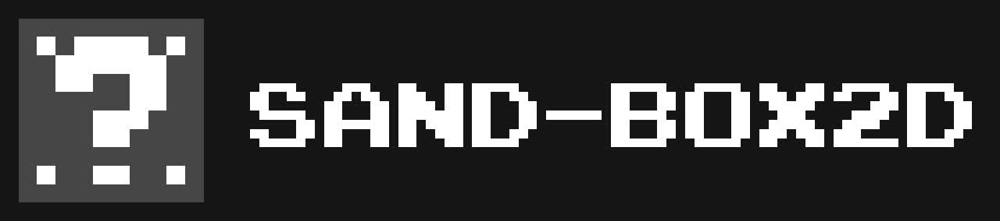
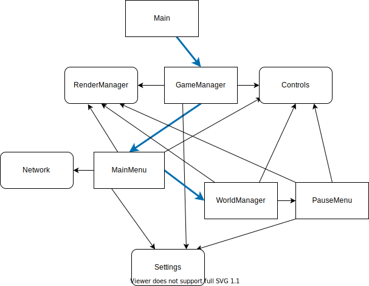

<h1 align="center">
  An open source cross-platform game based on Box2D with SDL2
</h1>

[Sand-Box2D](https://github.com/Hammerill/Sand-Box2D) is a game where you can try out possibilities of the Box2D physics engine,
can [make your own levels](https://github.com/Hammerill/Sand-Box2D-levels) and share them with others.

This project was developed mainly for educational purposes.
I've started developing it for myself just to understand basis of Box2D, how to link it with SDL2 and etc. 
But then, I've realized it could be more than just some rewritten code: a game.
So, I took [this project](https://github.com/eder13/Box2D-SDL2-Demo) as the base,
have rewritten it from zero using OOP, and now you're free to play this game and use its code at way as you want.


<h2 align="center">
  Get it for your platform
</h2>
<div align="center">
  <a href="#on-windows">
    
  </a>
  <a href="#on-linux">
    
  </a>
  <a href="#for-ps-vita-1">
    
  </a>
</div>

## Contents
- [Controls](#controls)
  * [For Desktops](#for-desktops)
  * [For PS Vita](#for-ps-vita)
- [Future plans](#future-plans)
  * [List of little tasks](#list-of-little-tasks)
- [Future architecture](#future-architecture)
- [Build](#build)
  * [On Windows](#on-windows)
  * [On Linux](#on-linux)
  * [For PS Vita](#for-ps-vita-1)
- [Credits](#credits)

<hr>

## Controls
### For Desktops
- <kbd>WASD</kbd> and <kbd>Space</kbd>/<kbd>R</kbd>/<kbd>Enter</kbd> - actions.
- <kbd>Arrows</kbd> - move camera.
- <kbd>Q</kbd>/<kbd>E</kbd> - adjust zoom.
- <kbd>Tab</kbd> - on/off debug screen.
- <kbd>F</kbd> - go/exit fullscreen (gonna be moved to options menu soon).
- <kbd>X</kbd> - reload current level (gonna be moved to options menu soon).
- Also, you can consider using mouse for camera controls and to go/exit fullscreen mode.

### For PS Vita
- <kbd>DPAD</kbd> and <kbd>Cross</kbd> - actions.
- <kbd>Left Stick</kbd> - move camera.
- <kbd>Right Stick</kbd> or <kbd>L</kbd>/<kbd>R</kbd> - adjust zoom.
- <kbd>Triangle</kbd> - on/off debug screen.
- <kbd>Circle</kbd> - reload current level (gonna be moved to options menu soon).
- Also, you can consider using touchscreen for camera controls.

## Future plans
- ~~Add support for loading custom levels~~ ✅ Done!
- (~~Make a main menu~~ ✅ Done!, but) where player can:
  * Download, manage and (~~start~~ ✅ Done!) levels;
  * Adjust settings;
  * Access menu "About".
- Implement level editor (right now to make levels you need to manually edit JSON).
- Add support of a lot of objects (joints included).

Feel free to propose ideas [here](https://github.com/Hammerill/Sand-Box2D/discussions)!

### List of little tasks
1. ~~Remove hardcoded Font loading code~~ ✅ Done!
2. ~~Adapt camera while on/offing the fullscreen mode~~ ✅ Done!
3. ~~Realize attached camera mode and consider camera:move and camera:zoom options~~ ✅ Done!
4. ~~When WorldManager just initialized, show some effect, like lighten everything from the darkness and show level's title. Based on how other games show level starting animation, Sonic for example~~ ✅ Done!
5. ~~Realize simple MainMenu for beginning, buttons list like "PLAY", "ABOUT", "EXIT". When PLAY clicked everything dims and after that (when everything became black) tell GameManager somehow that MainMenu is no longer used and it needs to init WorldManager which will load desired level (and it will load animation from step 4)~~ ✅ Done!
6. ~~Hide mouse when user doesn't use it~~ ✅ Done!
7. In game (when no fade anims are running) you can call PauseMenu. When you do that, physics stop and you can access these buttons: "RESUME" (close PauseMenu and return to game), "SETTINGS" (open OptionsMenu and keep game state) and "EXIT" (starts fadeout effect, during which we can see physics temporary resume. At the end returns us to MainMenu). `START` button with which we opened PauseMenu should also close it. Blur background when entering PauseMenu.
8. MainMenu for release state at future:
  - ~~At first launch it asks to choose interface language (CHOOSE YOUR LANGUAGE (...) YOU CAN CHANGE IT LATER IN THE SETTINGS). When cycling through languages, interface language will automatically change to the hovered one~~ ✅ Done!
  - ~~If platform is PS Vita, when game just inited video it should fade out of the pics/sce_sys/pic0.png, because it's a picture that shown when game is loading on Vita~~ ✅ Done!
  - ~~In main menu at the top is Sand-Box2D logo shown. If player clicks at the box (either with mouse or touchscreen), it will fall off and collide with menu item selector, by moving it up-down player can throw the box, and all that happens while remaining Sand-Box2D text fades out. When player manages to lose the box, logo returns to its place~~ ✅ Done!
  - Main menu consists of these items:
    * `PLAY` - will load list of default levels that always shipped with game.
    * `COMMUNITY` - will load list of [community published levels](https://github.com/Hammerill/Sand-Box2D-levels).
    * `LEVEL EDITOR` - will load menu that shows: "Look, they're working on it! They're working hard! You think they do not work fast enough? Join them then! More info in 'ABOUT'!" and picture of some facility construction with the name of "SAND-BOX2D LEVEL EDITOR", where we also can see builders, which are in fact contributors with their names above them, and we can guess what type of work they do by looking at picture.
    * `SETTINGS` - will fade out MainMenu and load OptionsMenu.
    * `ABOUT` - will load About menu, where player can see list of contributors, credits, and QR code with link to this repo, in order if they will want to contribute.
    * `EXIT` - yes.
  - what's My name? My name is Corner. Upper-Right Corner.

## Future architecture


## Build 
If you don't want to build by yourself, you can consider auto build system provided by GitHub [actions](https://github.com/Hammerill/Sand-Box2D/actions).
### On Windows
1. Ensure you have all necessaire tools installed and wrote to your PATH variable (cmake, make, mingw (g++), git, etc.).
2. Install packages:
- You need to install all those packages and unpack them in the same directory:
  * [SDL2](https://github.com/libsdl-org/SDL/releases/tag/release-2.24.0)
  (put contents of SDL2-devel...mingw.zip/x86-64... somewhere, for all next packages use the same dir);
  * [SDL_Image](https://github.com/libsdl-org/SDL_image/releases/tag/release-2.6.2);
  * [SDL_Mixer](https://github.com/libsdl-org/SDL_mixer/releases/tag/release-2.6.2);
  * [SDL_ttf](https://github.com/libsdl-org/SDL_ttf/releases);
  * [SDL2_gfx](https://www.ferzkopp.net/wordpress/2016/01/02/sdl_gfx-sdl2_gfx/);
  * [Box2D](https://github.com/erincatto/box2d);
  * [jsoncpp](https://github.com/open-source-parsers/jsoncpp);
  * [libcurl](https://github.com/curl/curl).
- Or simply just unpack contents of [this](https://github.com/Hammerill/Sand-Box2D/releases/download/v1.0.0/win64-packages.zip) archive somewhere. 
- Also, you have to add "bin" directory (located where the packages are installed) to your PATH variable,
or copy its contents (*.dll) to the same directory where .exe file should be (build).
3. Clone repo:
  ```cmd
  git clone https://github.com/Hammerill/Sand-Box2D && cd Sand-Box2D
  ```
4. Build (at the 4th line at the end change path to where you have installed packages or extracted an archive):
  ```cmd
  mkdir build
  cd build
  cmake .. -G "MinGW Makefiles"
  cmake .. -DBUILD_WINDOWS_PKGS=C:/path/to/pkgs
  make
  ```
5. EXE file should appear, you can now launch this game:
  ```cmd
  Sand-Box2D.exe
  ```

If you experience errors with Jsoncpp library while building try to disable `HEADER_WITH_JSONCPP` flag via this:
  ```
  cmake .. -DHEADER_WITH_JSONCPP=OFF
  make
  ```

### On Linux
1. Install following libraries somehow with your package manager:
- SDL2;
- SDL2_image;
- SDL2_mixer;
- SDL2_ttf;
- SDL2_gfx;
- Box2D;
- jsoncpp;
- libcurl.
2. Clone repo:
  ```bash
  git clone https://github.com/Hammerill/Sand-Box2D && cd Sand-Box2D
  ```
3. Build:
  ```bash
  mkdir build
  cd build
  cmake .. -DBUILD_WINDOWS=OFF -DBUILD_LINUX=ON
  make -j4
  ```
4. Executable should appear, you can now launch this game:
  ```bash
  ./Sand-Box2D
  ```

If you experience errors with Jsoncpp library while building try to disable `HEADER_WITH_JSONCPP` flag via this:
  ```
  cmake .. -DHEADER_WITH_JSONCPP=OFF
  make -j4
  ```

### For PS Vita
Build for PS Vita should be performed in Linux environment (or in MSYS2 in Windows, see step 1).
1. Install [VITASDK](https://vitasdk.org/).
2. Clone repo:
  ```bash
  git clone https://github.com/Hammerill/Sand-Box2D && cd Sand-Box2D
  ```
3. Build:
  ```bash
  mkdir build
  cd build
  cmake .. -DBUILD_WINDOWS=OFF -DBUILD_VITA=ON
  make -j4
  ```
4. VPK file should appear. Copy this file to your hacked PS Vita and install via VitaShell.
5. Bubble "Sand-Box2D" will appear, you can now launch this game.

## Credits
- [eder13](https://github.com/eder13) - base project (Box2D-SDL2-Demo) author.
- [codeman38](https://www.fontspace.com/codeman38) - main font (PressStart2P) author.
- [Ultra Cool Fonts](https://www.fontspace.com/ultra-cool-fonts) - Japanese font (Madou Futo Maru Gothic) author.
- [Hammerill](https://github.com/Hammerill) - author of this game.
- To everybody who contributes to open source, to those who made these (used in the project) libraries exist.

Translations:
- English, Russian and Ukrainian - Hammerill.
- French and Japanese - Hammerill with aid of Google Translate.
